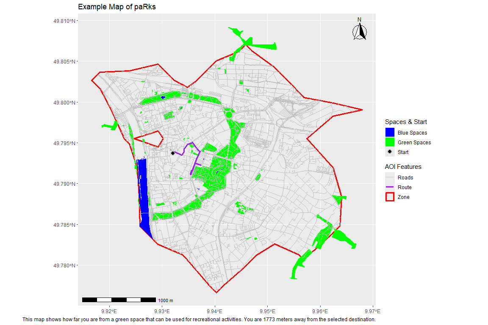

<!-- README.md is generated from README.Rmd. Please edit that file -->

# paRks

<!-- badges: start -->
<!-- badges: end -->

paRks is a package that allows you to find different types of
recreational spaces. You can input your address or your location and
select whether you want to find the nearest or largest green or blue
space. Using paRks you can then generate a map showing you the route to
take to your selected space. paRks is colorblind friendly and includes
color support for deuteranopia, protanopia as well as tritanopia.

## Installation

You can install the development version of paRks like so:

``` r
library(devtools)
install_github("Miner501/paRks")
```

## Example

The first step of using paRks is to geocode an address or a set of
lat/lon coordinates.

``` r
library(paRks)

location <- geocode_address("Kiliansplatz, Wuerzburg")
#> Passing 1 address to the Nominatim single address geocoder
#> Query completed in: 1 seconds
```

Once an address or location has been geocoded, you can input the maximum
distance you are willing to travel to find an adequate blue or green
space.

``` r

zone <- travel_zone(location, distance_km = 5)
```

Once the zone has been calculated based on OSM routing information you
must fetch the blue and green spaces of within the zone as well as the
road network. The road network is useful to make the final map more
visually pleasing.

``` r
greens <- get_greenspaces(zone, mode = "standard") # mode can also be set to "broad" to include any type of green space, even ones that may not be publicly accessible.
#> Green features returned: 157

blues  <- get_bluespaces(zone)
#> Blue features returned: 69

roads  <- get_roads(zone)
#> Road features returned: 6174
```

At this point you can now start navigating. You can select if you would
like to be navigated to a green or blue space. If selecting a green
space you also have the choice between the largest and closest.

``` r
result <- navigate_to_target(
  location = location,
  zone = zone,
  greens = greens,
  blues = blues,
  target_type = "green",     # or "blue"
  preference = "largest"     # or "largest"
)
```

Finally we can plot our results on a map.

``` r
plot_travel_map_gg(
  zone = zone,
  greens = greens,
  blues = blues,
  roads = roads,
  route = result$route,
  route_distance = result$length_m,
  start_location = location,
  target_type = "green",  # or "blue"
  palette = "normal" #this is where you can select if you have any form of colorblindness mentioned earlier in the Readme
)
#> Warning: attribute variables are assumed to be spatially constant throughout
#> all geometries
#> Warning: attribute variables are assumed to be spatially constant throughout
#> all geometries
#> Warning: Removed 45 rows containing missing values or values outside the scale range
#> (`geom_sf()`).
```


